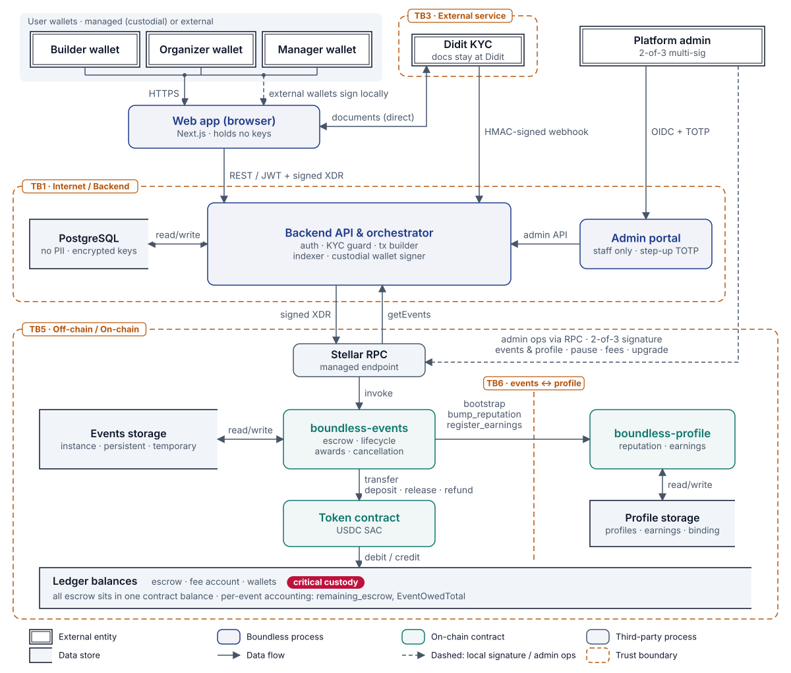
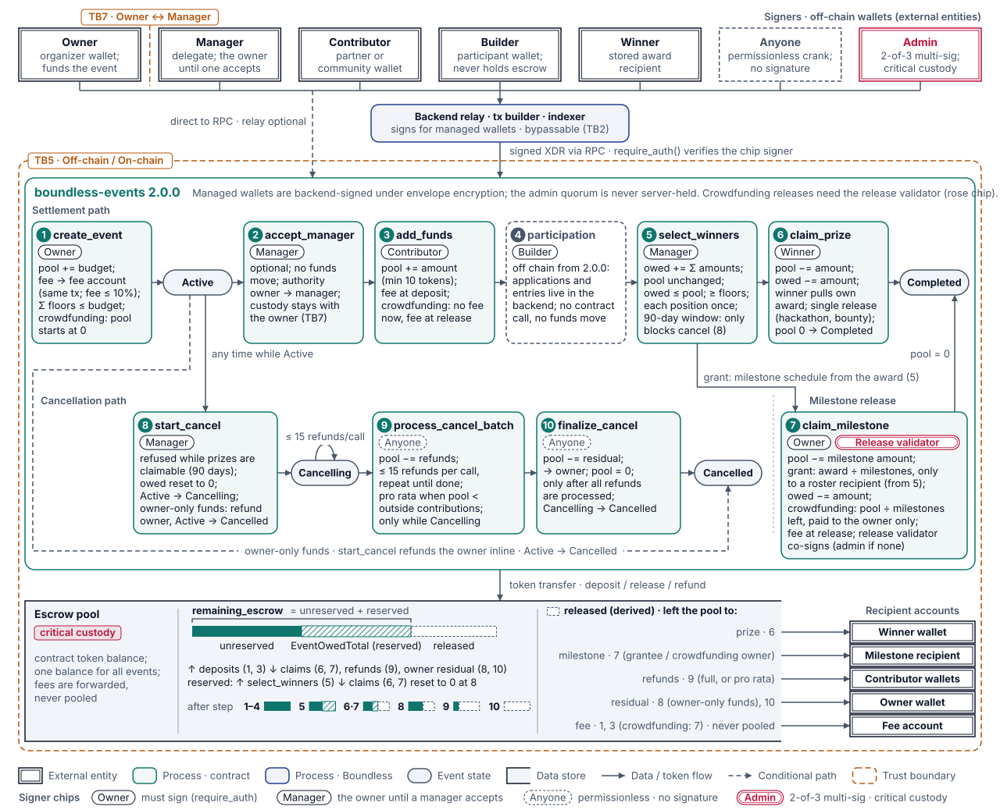

# Boundless STRIDE Threat Model

**Version:** 1.2  
**Date:** 3 October 2026  
**Prepared for:** Stellar Development Foundation, Soroban Security Audit Bank  
**Prepared by:** Boundless Engineering  
**Contracts under review:** `boundless-events` 2.0.0 and `boundless-profile` 1.2.1. Mainnet runs 1.7.0 and 1.2.0 until the upgrade in Section 4.4.  
**Repository:** github.com/boundlessfi/boundless-contract  
**Changes in 1.2:** reworded for clarity, retired threats moved to their own table, flow steps renumbered after the participation removal, statuses limited to four defined values, and Section 4 reorganized.

---

## Summary

This is the threat model for the two Soroban contracts behind Boundless: `boundless-events`, which holds prize money in escrow and runs hackathons, bounties, grants and crowdfunding campaigns, and `boundless-profile`, which records builder reputation and earnings. It follows the Stellar Development Foundation's four questions: what are we working on, what can go wrong, what are we going to do about it, and did we do a good job.

The model lists 76 threats across the six STRIDE categories, each tied to a step in the on-chain flow and to a trust boundary, and each rated for likelihood and impact.

| Status | Meaning | Count |
|---|---|---|
| Mitigated | A control in the contracts or in operating procedure addresses the threat. Every contract-level control has a test that proves it fails safely. | 62 |
| Accepted | The remaining risk is carried on purpose, with the reason written down. | 10 |
| Retired | The feature the threat described was removed, so the threat no longer applies. | 4 |
| Open | No treatment yet. | 0 |

All ten Priority 1 threats, whose failure would be catastrophic, are mitigated and tested.

**Pending deployment** describes code, not threats: every 2.0.0 fix is in the code under review but not yet on mainnet. Section 4.4 lists what the upgrade involves and what the backend must ship first.

## 1. What are we working on?

### 1.1 Overview

Boundless coordinates hackathons, bounties, grants and crowdfunding campaigns on Stellar. Its central promise is that prize money is safe before anyone starts work: the budget is locked in a Soroban contract when the program is created and can leave only to winners, to milestone recipients, or back to its funders. Neither the owner nor the admin can redirect it.

Each event is an open pool with published minimum prizes. The owner deposits a budget and publishes a minimum for each prize position (`prize_floors`). An award can be higher than its minimum, never lower, and every award is reserved against the pool so that a later selection cannot promise money an earlier winner is still owed.

Joining an event and submitting work happen on the platform, not in the contracts. The contracts hold only what money depends on: budgets, contributions, awards, payouts and refunds.

| Term | Meaning |
|---|---|
| Owner | The account that creates and funds an event. The pool always belongs to the owner and the contributors. |
| Manager | An optional delegate who, once they accept, makes selection and cancellation decisions for one event. Without one, the owner is the manager. The owner can take management back until the first award. |
| Contributor | Any account that adds money to an event's pool. |
| Builder | An account that takes part in an event. A winner is a builder named in a selection. |
| Admin | The platform's 2-of-3 multi-signature account, the only privileged role in either contract. It may appoint a release validator to co-sign crowdfunding payouts in its place. |
| Single-release event | A hackathon or bounty. Each winner collects their prize with `claim_prize` within 90 days. |
| Multi-release event | A grant or crowdfunding campaign, paid per milestone with `claim_milestone`. A grant milestone the owner decides not to pay is closed with `forfeit_milestone`. |
| Managed and external wallets | A managed wallet's key is created, stored encrypted and used by the platform for the user. An external wallet, such as Freighter, keeps its key on the user's device. |

### 1.2 Scope and assets

**In scope:** both contracts at the versions above, the calls between them, their admin operations, and admin account custody. The backend, web application and admin portal are covered only where they touch the contracts or hold something that could affect them.

**Out of scope:** backend and web-application internals, the Didit identity service, the Stellar network and Soroban host (assumed correct, see 1.7), and the issuers of supported tokens.

| Asset | Where it lives | Why it matters |
|---|---|---|
| Escrow funds | One token balance held by `boundless-events` for all events (80 USDC across two active bounties on mainnet on 3 October 2026) | Critical. Anything that can move or lock it is the highest-value target. |
| Per-event accounting | `remaining_escrow`, `EventOwedTotal`, winner records, prize awards, contributor amounts | Critical. Every payout and refund is computed from it. |
| Admin signer keys | Three signers on separate machines, two required | Critical. The quorum can pause, change fees, re-point bindings and replace contract code. |
| Fee account key | Same custody as the admin | High. Receives all platform revenue. |
| Prize floors and event terms | `EventRecord` | High. The published guarantee builders rely on. |
| Managed wallet keys | PostgreSQL, encrypted per wallet under a master key that exists only in the backend environment | Critical. With the master key they control every managed wallet. |
| External wallet keys | User devices | High for the affected event. |
| Reputation and earnings | `boundless-profile` | Medium. Informational, with no on-chain privilege. |
| Backend secrets | Server environment | Critical for the master key, High for the rest. No server-held secret can act as the admin. |
| Identity data | Didit only | High. Never enters Boundless systems. |
| Off-chain service availability | Backend, RPC provider, Didit | Medium. An outage delays operations but cannot move funds; the contracts can always be called directly. |

### 1.3 Components

| Component | Role |
|---|---|
| `boundless-events` | Escrow and lifecycle for all four event types: deposits, reservations, payouts, refunds, contributor records, winner awards, the grant roster, milestone payouts and forfeits, paged cancellation, manager delegation, and timelocked upgrades with paged migration. Mainnet: `CCFVEGOQJEM47LRAJU2LHEK4KTL5VYN7AOGZ2HH2GNHAMXTILNMMJGQZ`. |
| `boundless-profile` | Each user's reputation score and lifetime earnings per token. Changed only by the events contract, except that users may create their own empty record. Mainnet: `CD3KH4OE7HDHHHUYFX3U4L7NLIILMXAY6HM5FEH2UH6UBOKX4HDNE3PC`. |
| Backend orchestrator | NestJS service holding event content, user accounts, event entries and judging, KYC state and drafts. Builds and sends transactions, indexes contract events, and prepares crowdfunding payouts for co-signing. Runs the managed-wallet service (creates, sponsors, stores and signs). It does not hold the admin quorum. |
| Web application | Next.js front end. External wallets sign in the browser. |
| Admin portal | Staff-only application with a fresh TOTP code required for sensitive changes. |
| Didit KYC | External identity verification. Users send documents to Didit directly; Didit returns signed webhooks. |
| Stellar RPC | Managed Soroban RPC endpoint for sending transactions and reading events. |
| Admin | 2-of-3 multi-signature account `GCVK72I6TVJVDTTY4UKU6MQT4QJ2T2AAG3NULNEUDM46L3UOQYDSO4O2` (three signers of weight 1, medium and high thresholds of 2, master key weight 0). Holds every privileged operation: pause, fees, the token list, upgrades, migration, admin rotation, and appointing the release validator. It co-signs crowdfunding payouts itself while no validator is appointed. |
| Fee account | `GADSIP2HPINWTMEUNMVYA5NJRL372OV52HDEJTRTLDZXMHADIPQNYH55`. Receives platform fees; same custody as the admin. |
| User wallets | Stellar accounts with a trustline to a supported token (USDC on mainnet), either managed or external. |

### 1.4 On-chain flow

The threat tables in Section 2 refer to these steps by number.

1. **Deploy and configure.** The admin deploys `boundless-profile`, then `boundless-events` with the admin, fee account, fee rate and profile address. The two are bound with `set_events_contract`; the first binding is one step, and any later change is a timelocked two-step rotation. The admin then registers supported tokens.
2. **Create.** The owner calls `create_event`. For hackathons, bounties and grants, the budget plus the platform fee is taken from the owner in the same transaction; the fee goes to the fee account. Crowdfunding campaigns start empty. Prize floors must be positive and total no more than the budget. A manager may be proposed.
3. **Delegate (optional).** The proposed manager accepts with `accept_manager` within 17,280 ledgers (about one day) and then makes selection and cancellation decisions. Until the first award, the owner can take management back with `reclaim_management`.
4. **Top up.** Contributors call `add_funds` with at least 10 tokens. Outside crowdfunding the fee is paid on deposit; crowdfunding takes its fee at payout. The contract keeps a running total of money from contributors other than the owner, for refunds.
5. **Select.** The manager calls `select_winners` with awards (recipient, position, amount, reputation bump): up to 20 per call for hackathons and bounties, over any number of calls, or one call of up to 40 for a grant. Each position is awarded once, at or above its floor, with a bump of at most 100, and the awards plus everything awarded but unpaid (`EventOwedTotal`) must fit within `remaining_escrow`. A grant gives each recipient one award of at least one stroop per milestone and records it in a grant roster. Hackathon and bounty selections open or extend a 90-day claim window.
6. **Claim a prize.** Each winner calls `claim_prize`. The contract records the payment, transfers the tokens, then updates the winner's profile on a best-effort basis.
7. **Settle a milestone.** For a grant, the owner pays a milestone with `claim_milestone` or closes it unpaid with `forfeit_milestone`, which releases that share but leaves it in the pool. Each milestone is settled once and is worth an even share of the award; the last takes the rounding remainder. The contract records, transfers, then updates the profile best-effort. Crowdfunding also needs the release validator's signature (the admin's while none is appointed), pays the owner `remaining_escrow / milestones_left`, and takes the fee at payout.
8. **Cancel.** The manager calls `start_cancel`, which is refused while a hackathon or bounty prize is in its claim window or a grant award is owed. Without outside contributors the event settles at once; otherwise it enters `Cancelling`, anyone may run `process_cancel_batch` (up to 15 refunds per call) and `finalize_cancel` returns the owner's remainder. A refund an account cannot receive is set aside for `claim_refund`.
9. **Govern.** The admin may pause and unpause, change the fee (at most 10%) and fee account, manage the token list, appoint the release validator, rotate the admin in two steps, and upgrade: `propose_upgrade`, `apply_upgrade`, `migrate_events` (up to 8 events per call) and `migrate` (a one-time version stamp).

### 1.5 Data-flow diagrams

*Figure 1: System data-flow diagram. Element types are identified in the legend; dashed amber regions are trust boundaries.*

*Figure 2: Escrow lifecycle inside `boundless-events`. Each step shows which key must sign it and how the pool balance moves; the lower band shows how the pool is accounted for and where money leaves to.*

### 1.6 Trust boundaries

| ID | Boundary | Description |
|---|---|---|
| TB1 | Internet / Backend | All user input is untrusted, and is checked by authentication, KYC status and input validation. The contracts trust nothing the backend accepts (TB5). |
| TB2 | Backend / Stellar network | Anyone can call the contracts directly. The backend reads chain state before acting and never assumes it is the only writer. |
| TB3 | Backend / Didit | External service with HMAC-authenticated webhooks. No identity data crosses into Boundless systems. |
| TB4 | Admin browser / Admin portal / Backend | Staff only, with single sign-on and a fresh TOTP code for sensitive actions. |
| TB5 | Off-chain / On-chain | The contracts enforce every rule themselves, and each state change needs the signature of the owner, manager, winner, contributor or admin quorum. The backend can never do more than the wallets it can sign for: nothing for external wallets, and that wallet's own authority for managed ones. A backend compromise that also obtains the master key could act as any managed wallet (Spoof.10), but never as the admin quorum, whose three signers are external. |
| TB6 | events ↔ profile | The profile contract accepts changes only from the bound events contract, and the events contract treats a failed profile call as non-fatal on both payout paths. |
| TB7 | Owner ↔ Manager | The manager can select, cancel and rotate, but never holds custody: refunds go to the owner and contributors, and only the owner can pay or forfeit milestones. The owner can take management back until the first award. |

### 1.7 Threat actors and assumptions

| Actor | Capability | Motivation |
|---|---|---|
| Anonymous network participant | Can call any public entry point and replay captured transactions; cannot forge signatures. | Theft, disruption, griefing. |
| Builder or contributor | A participant acting in bad faith, for example removing a trustline so a refund cannot be delivered. | Advantage in a program; griefing an owner. |
| Owner or manager | Can create, fund, select and cancel for their own event; may try to reclaim or redirect a pool. | Financial gain at builders' expense. |
| Compromised backend | Can submit any transaction, corrupt off-chain data and leak secrets. With the master key it can sign as any managed wallet, never as the admin. | Theft from events run by managed wallets; limited by TB5. |
| Compromised single admin signer | One of three signers; cannot meet the threshold alone. | A stepping stone to the quorum. |
| Compromised or coerced admin quorum | Full administrative control, including upgrades (after a 17,280-ledger timelock from 2.0.0; immediately on the 1.7.0 build still deployed). | Theft by replacing contract logic. |
| Token issuer | Can freeze or claw back balances under the asset's policy. | Compliance, not malice; treated as an availability event. |
| Infrastructure providers (RPC, Didit) | Outages, stale or wrong data, forged messages. | Failure or compromise of a third party. |

The model relies on these assumptions. A threat that needs one of them to fail is out of scope unless listed.

- The Soroban host behaves as specified: `require_auth` checks for a matching signature, a contract cannot be re-entered during a call, execution is deterministic, and resource limits are enforced.
- Stellar consensus is final; there are no reorganizations.
- Ed25519 signatures cannot be forged, and users control their own keys. A lost key is the user's risk, except where the design makes it everyone's (DoS.9).
- Supported tokens are standard Stellar asset contracts, curated by the admin.
- The admin signers' machines are not compromised at the same time.
- Users who choose a managed wallet accept that the platform holds its key, under the controls in Spoof.10.
- Judging happens off chain. The contracts guarantee custody and the published floors, not the fairness of a selection.
- The contracts use soroban-sdk 28, which reads stored structures leniently: a missing optional field reads as empty and an unknown field is ignored. No control depends on a read failing. The migration recognises the older event layout by its `winner_distribution` field, and a test replays the real mainnet upgrade to confirm it (`docs/storage-compatibility.md`).

### 1.8 Data stores

| Store | Location | Contents | Sensitivity |
|---|---|---|---|
| Events contract, instance storage | Stellar ledger | Admin and pending admin, fee account and rate, pause flag and clock, deployment sequence, profile address, version, pending upgrade, migration cursor, token list, release validator | Public; only the admin writes it. |
| Events contract, persistent storage | Stellar ledger | Event records, managers, contributors and winners (one entry each), prize awards, the grant roster and progress, owed totals, claim-window data, contributor amounts, settled-milestone flags, cancellation state, refunds held for collection | Public, pseudonymous. Event reads extend each record's lifetime. |
| Events contract, temporary storage | Stellar ledger | Idempotency markers keyed by signing address and operation id | Public; each lasts at least 17,280 ledgers (about one day) on mainnet. |
| Profile contract | Stellar ledger | `Profile{bootstrapped_at, reputation}`, earnings per token, admin and binding settings, idempotency markers | Public, pseudonymous. |
| Contract token balance | Stellar ledger | All escrow for all events in one balance; the split per event lives in `remaining_escrow` and `EventOwedTotal` | Critical. Released only by contract logic. |
| PostgreSQL | Boundless servers | Accounts, event entries and drafts, escrow operation log, KYC status (session id and status only), audit log, encrypted managed-wallet keys | Critical for the keys, medium otherwise. |
| Didit | Didit infrastructure | Identity documents, biometrics, decisions | High; held only by Didit. |
| Admin signer keys | Three separate machines | Wallet keys (moving to hardware keys under the custody policy) | Critical. |
| Backend environment | Server environment variables | Master key, session secret, Didit key, transaction settings | Critical (master key). |

### 1.9 Key parameters

| Parameter | Value |
|---|---|
| Maximum fee | 1,000 bps (10%) |
| Upgrade timelock | 17,280 ledgers (about one day) on mainnet builds from 2.0.0; 0 on testnet builds. The deployed 1.7.0 build has 0 (Section 4.4). |
| Upgrade proposal expiry | 518,400 ledgers (about 30 days) |
| Admin rotation and release validator acceptance windows | 120,960 ledgers (about 7 days) each |
| Manager proposal expiry | 17,280 ledgers (about one day) |
| Profile binding rotation | 17,280-ledger timelock, 120,960-ledger expiry |
| Prize claim window | 90 days of unpaused time from the most recent selection |
| Awards per `select_winners` call | 20 for hackathons and bounties (repeatable); 40 for a grant (one selection) |
| Refunds per `process_cancel_batch` call | 15 |
| Read page size | 90 entries |
| Reputation bump per award or payout | At most 100 |
| Grant award | At least one stroop per milestone |
| Minimum contribution | 10 tokens (100,000,000 stroops at 7 decimals) |
| Title length | 120 bytes |
| Events per `migrate_events` call | 8 |
| Contributors per event | No cap; each contribution is its own ledger entry, paid for by the contributor |
| Per-transaction limits | 100 footprint entries and 50 written entries on mainnet. A test runs every cap above at its maximum on a test host that enforces these limits. |

---

## 2. What can go wrong?

### 2.1 STRIDE categories

| Category | Definition | Question it asks |
| --- | --- | --- |
| Spoofing | Pretending to be another user or component. | Is the caller who they say they are? |
| Tampering | Changing data or code without authorization. | Has the data or code been altered? |
| Repudiation | Denying an action that was taken. | Is there evidence of who did what? |
| Information Disclosure | Exposing data that should stay private. | Is anything shared that should not be? |
| Denial of Service | Making the system or funds unavailable. | Can someone block the service or lock funds? |
| Elevation of Privilege | Gaining powers beyond those granted. | Can someone act with authority they were not given? |

### 2.2 Threat table

Steps refer to Section 1.4, TB numbers to Section 1.6. Ratings are before treatment; Section 3 gives the result.

Likelihood (L) is how easily the threat can be attempted, given who must act and what access they need: Low, Medium or High. Impact (I) is what is lost if it succeeds: Low (cosmetic or easily reversed), Medium (non-financial data, one flow's availability, or off-chain privacy), High (funds lost or locked for one event or party), or Critical (escrow lost or locked across events, or control of a contract). Priority combines them. P1 is critical impact with medium or high likelihood, or high impact with high likelihood. P2 is critical with low, high with medium, or medium with high. P3 is high with low, medium with medium, or low with high. P4 is everything lower.

The four retired threats are in Section 4.3, not here.

#### Spoofing

| ID | Threat | Affected component | L | I | Priority |
|---|---|---|---|---|---|
| Spoof.1 | (Steps 2, 4) A caller names another user as `owner` or `from` in `create_event` or `add_funds`, to act or spend on their behalf. | `boundless-events` | H | C | P1 |
| Spoof.2 | (Step 7) An attacker obtains the key that co-signs crowdfunding payouts, for example through a backend compromise, and releases milestones early. | `claim_milestone`, admin custody | L | H | P3 |
| Spoof.3 | A forged Didit webhook approves a user's KYC. | Backend webhook endpoint | M | M | P3 |
| Spoof.4 | A stolen staff session is replayed against the admin portal without a fresh TOTP code. | Admin portal and API | M | M | P3 |
| Spoof.5 | (Step 9) A single signer submits an admin transaction claiming to be the multi-signature account. | Admin account | L | C | P2 |
| Spoof.6 | (Step 6) An attacker claims someone else's prize, or a manager claims a winner's prize into another wallet. | `claim_prize` | H | H | P1 |
| Spoof.7 | (Step 3) An event is given a manager who never agreed, suggesting that a known organization runs it. | Manager delegation | M | L | P4 |
| Spoof.8 | (Steps 6, 7) Something other than the events contract calls `bootstrap`, `bump_reputation` or `register_earnings` on the profile contract. | `boundless-profile` (TB6) | H | M | P2 |
| Spoof.9 | (Step 9) An admin signer's software key is stolen and combined with a second compromised or coerced signer to meet the threshold. | Admin custody | L | C | P2 |
| Spoof.10 | (Steps 2 to 8) An attacker who compromises the backend and obtains the master key acts as any managed owner, manager, builder or winner: selecting their own winners, cancelling an event and withdrawing a managed owner's refund, or claiming prizes. | Managed-wallet service (TB5) | L | C | P2 |

#### Tampering

| ID | Threat | Affected component | L | I | Priority |
|---|---|---|---|---|---|
| Tamp.1 | (Steps 2, 5) An owner lowers the advertised prizes after builders have committed work. | `boundless-events` | M | H | P2 |
| Tamp.2 | (Step 5) A selection awards more than the pool holds, drawing on other events' money in the shared token balance. | Escrow accounting | M | C | P1 |
| Tamp.4 | A compromised RPC node feeds false event data to the indexer. | Backend indexer | L | M | P4 |
| Tamp.5 | (Step 9) Contract code is swapped between proposing and applying an upgrade, or unreviewed code is applied. | Upgrade flow | L | C | P2 |
| Tamp.6 | (Step 9) A partly signed multi-signature transaction is altered in transit. | Signing workflow | L | C | P2 |
| Tamp.7 | Integer overflow or underflow in an index or counter corrupts a record. | Storage helpers, `select_winners` | L | H | P3 |
| Tamp.8 | (Step 5) An event promises the same money twice. The pool only shrinks when a winner claims, so without a reservation a second selection would see money an earlier winner is still owed. | `select_winners` | M | H | P2 |
| Tamp.9 | (Step 5) A manager awards a position less than its published minimum. | `select_winners` | M | M | P3 |
| Tamp.10 | (Step 9) Records in the older percentage-based layout cannot be read by current code. A migration that stops part-way, stamps the version early, or miscalculates what is owed could strand or double-count money. | `migrate_events`, `migrate` | M | C | P1 |
| Tamp.11 | (Steps 6, 7) The token calls back into the events contract during a payout and gets one claim paid twice. | Payout paths | L | C | P2 |
| Tamp.12 | (Step 5) A position is listed twice in one selection, or awarded again later, so one prize is paid twice. | `select_winners` | M | H | P2 |
| Tamp.13 | (Steps 2 to 8) A backend retry or a replayed request performs one operation twice, such as two deposits or two claims. | Idempotency layer | H | H | P1 |
| Tamp.14 | (Steps 6, 7) The events contract derives operation ids for its profile calls from the caller's operation id. If they were not tied to the caller, an attacker who learned a victim's id could use the derived id first, making the victim's payout fail or skip its profile update. | Idempotency layer (TB6) | L | M | P4 |
| Tamp.15 | (Step 8) A manager cancels a hackathon or bounty after builders have done the work but before any selection, and takes back the budget. | `start_cancel` | M | M | P3 |
| Tamp.16 | (Step 5) A grant selection names one recipient at two positions, leaving one award reserved and unpayable. | `select_winners`, `claim_milestone` | L | M | P4 |
| Tamp.18 | (Steps 5, 7) A grant award smaller than its number of milestones rounds every share but the last to zero, so the award can never be paid. | `select_winners`, `claim_milestone` | L | M | P4 |
| Tamp.19 | (Steps 7, 9) A migration that recalculates what an event owes from its winner records misses forfeits, which write no record, and reserves the forfeited share again; the grant can then never be cancelled. Every upgrade migrates the events created since the last one, so live grants are exposed. | `migrate_events` | M | H | P2 |

#### Repudiation

| ID | Threat | Affected component | L | I | Priority |
|---|---|---|---|---|---|
| Repud.1 | (Step 5) A manager denies selecting the winners on record. | `select_winners` | M | M | P3 |
| Repud.2 | (Step 6) A winner claims they were never paid. | Stellar ledger | M | M | P3 |
| Repud.3 | A staff member denies making a KYC override. | Backend audit log | L | M | P4 |
| Repud.4 | (Step 8) A contributor claims they were never refunded, or a manager denies starting a cancellation. | Cancellation flow | M | M | P3 |
| Repud.5 | (Step 7) The platform denies co-signing a crowdfunding payout. | Transaction envelope | L | M | P4 |
| Repud.6 | (Step 3) After a disputed selection, a manager denies accepting the delegation, or an owner denies making it. | Manager delegation | L | M | P4 |

#### Information Disclosure

| ID | Threat | Affected component | L | I | Priority |
|---|---|---|---|---|---|
| Info.1 | All contract storage is public: addresses, prize floors, awards, earnings and reputation. | Stellar ledger | H | L | P3 |
| Info.2 | A database breach exposes identity documents. | Backend database | L | H | P3 |
| Info.3 | Signing keys or transaction secrets leak through logs, environment dumps or configuration output. | Backend environment | L | M | P4 |
| Info.4 | Staff sessions or TOTP secrets leak from a compromised admin workstation. | Admin portal | L | M | P4 |
| Info.5 | A Didit webhook payload is logged in plain text. | Backend logging | M | M | P3 |
| Info.6 | The fee account key is exposed and fees are diverted. | Fee account custody | L | H | P3 |
| Info.7 | (Step 5) A selection is visible on chain before the owner announces it. | `boundless-events` | H | L | P3 |

#### Denial of Service

| ID | Threat | Affected component | L | I | Priority |
|---|---|---|---|---|---|
| DoS.1 | (Step 4) Bots flood an event with tiny contributions, or the platform with entries, to bloat storage or crowd out real participants. | Contributor records, backend | H | M | P2 |
| DoS.2 | (Step 8) A cancellation with thousands of contributors needs more work than one transaction allows and never finishes. | Cancellation flow | M | C | P1 |
| DoS.3 | Unauthenticated request floods exhaust the backend. | Backend API | H | M | P2 |
| DoS.4 | The RPC provider becomes unavailable. | RPC dependency | M | M | P3 |
| DoS.5 | Fee-market spam delays legitimate transactions. | Stellar network | M | L | P4 |
| DoS.6 | Webhook floods exhaust KYC processing. | Backend webhook handler | M | L | P4 |
| DoS.7 | (Step 7) A paused or wrongly bound profile contract makes milestone payouts fail, if payouts depend on the profile update. | `boundless-events` (TB6) | L | H | P3 |
| DoS.8 | (Steps 5, 6, 8) Winners never claim, or lose their wallet, and the pool cannot be cancelled while a prize is inside its claim window. | `claim_prize`, `start_cancel` | M | M | P3 |
| DoS.9 | (Steps 3, 5, 8) Once a manager accepts, selection, cancellation and rotation need the manager's signature. If that key is lost, the owner cannot act and there is no admin override. | Manager delegation (TB7) | M | H | P2 |
| DoS.10 | (Step 9) A global pause stops claims and refunds while time-based windows could keep running. | Admin controls | L | H | P3 |
| DoS.11 | A dormant event's ledger entries expire and are unreadable until restored. | Storage lifetime | M | L | P4 |
| DoS.12 | (Step 9) A migration of a deployment with real history does not fit in one transaction; attempted in one go, it fails and leaves every event unreadable. | `migrate_events` | M | C | P1 |
| DoS.14 | (Step 8) A contributor's trustline is removed or frozen, so their refund cannot be delivered; if the batch cannot skip them, every later refund and the owner's remainder stay locked. | Cancellation flow | M | H | P2 |
| DoS.15 | (Steps 2, 4, 7) The fee account lacks or loses a trustline to a supported token, so deposits and crowdfunding payouts in that token fail until the fee account is changed. | Fee account configuration | L | H | P3 |
| DoS.16 | (Step 7) If a grant payout finds the award by reading every winner record, its cost grows with each payment; a grant with eight recipients and ten milestones passes the 100-entry transaction limit partway through and the rest can never be paid. | `claim_milestone` | M | H | P2 |
| DoS.17 | (Steps 5, 8) A batch or page larger than a transaction can hold. At mainnet's limits only 20 hackathon or bounty awards, 42 grant awards, 17 refunds or 97 read entries fit in one call, so a larger grant could never be awarded and larger refund batches and pages fail on big events. | `select_winners`, `process_cancel_batch`, read functions | M | H | P2 |

#### Elevation of Privilege

| ID | Threat | Affected component | L | I | Priority |
|---|---|---|---|---|---|
| EoP.1 | (Step 5) A builder calls `select_winners` and names themselves. | `select_winners` | H | C | P1 |
| EoP.2 | A read-only staff member performs a KYC override. | Backend authorization | L | M | P4 |
| EoP.3 | (Step 7) An owner releases a crowdfunding milestone without the co-signature. | `claim_milestone` | M | H | P2 |
| EoP.4 | A user's session is used on admin routes. | Backend staff check | M | M | P3 |
| EoP.5 | An attacker calls `bootstrap_self` with another user's address to take over their profile or operation ids. | `boundless-profile` | H | L | P3 |
| EoP.6 | (Step 9) An event owner calls an admin function such as `set_admin`, `propose_upgrade`, `register_supported_token` or `set_fee_account`. | Admin functions | H | C | P1 |
| EoP.7 | (Step 7) A crowdfunding milestone is co-signed for a payout the owner did not ask for. | `claim_milestone` | L | M | P4 |
| EoP.8 | (Steps 3, 5, 8) A manager gains owner powers: redirects refunds, changes the owner, pays milestones, or drains the pool by awarding itself. | Manager delegation (TB7) | M | H | P2 |
| EoP.9 | (Step 7) The owner pays a milestone to a non-winner or for an inflated amount. | `claim_milestone` | M | H | P2 |
| EoP.10 | (Step 9) With no upgrade timelock, a compromised or coerced quorum could propose and apply new code at once, leaving no time to react. | Upgrade flow, both contracts | L | C | P2 |
| EoP.11 | A non-admin calls `admin_slash_reputation`. | `boundless-profile` | M | M | P3 |
| EoP.12 | (Step 9) A non-admin calls `migrate_events` or `migrate` to rewrite records or stamp a version. | Migration functions | H | C | P1 |
| EoP.13 | (Step 1) The profile contract is re-bound to an attacker's contract, which then creates reputation and earnings at will. | `boundless-profile`, binding rotation | L | H | P3 |
| EoP.14 | (Steps 5, 8) A manager cancels a grant after recipients are selected but before they are paid, and the awarded money returns to the owner and contributors. | `start_cancel` (TB7) | M | H | P2 |
| EoP.15 | (Steps 5, 7) The reputation bump is chosen by the manager or owner. Without a cap, anyone could award themselves the maximum score through a small bounty. | `select_winners`, `claim_milestone`, `boundless-profile` | H | M | P2 |
| EoP.16 | (Step 1) The admin re-points the events contract's profile binding in one step (`set_profile_contract` has no timelock), changing every derived operation id at once and possibly stopping profile updates. | `set_profile_contract` (TB6) | L | M | P4 |

### 2.3 Priority summary

Of the 72 active threats, 10 are P1, 23 are P2, 23 are P3 and 16 are P4.

**Priority 1 (10).** The controls whose failure would be catastrophic, and the ones the audit should check first. All are mitigated and tested: Spoof.1 (acting under another user's address), Spoof.6 (claiming another winner's prize), Tamp.2 (spending more than the pool holds), Tamp.10 (migration correctness), Tamp.13 (replayed operations), DoS.2 (cancellations that cannot finish), DoS.12 (a migration too large for one transaction), EoP.1 (selection by someone other than the manager), EoP.6 (admin functions called by a non-admin), EoP.12 (migration called by a non-admin).

**Priority 2 (23).** Spoof.5 (one signer posing as the multisig), Spoof.8 (forged calls into the profile), Spoof.9 (admin key theft), Spoof.10 (managed-wallet custody), Tamp.1 (lowering advertised prizes), Tamp.5 (swapped upgrade code), Tamp.6 (altered multisig transaction), Tamp.8 (promising the pool twice), Tamp.11 (re-entry during a payout), Tamp.12 (paying one position twice), Tamp.19 (a migration re-reserving a forfeited share), DoS.1 (storage spam), DoS.3 (backend floods), DoS.9 (manager key loss), DoS.14 (an undeliverable refund blocking the rest), DoS.16 (growing payout cost), DoS.17 (batches larger than a transaction), EoP.3 (crowdfunding payout without the co-signature), EoP.8 (manager gaining owner powers), EoP.9 (milestone paid wrongly), EoP.10 (no upgrade timelock), EoP.14 (cancelling an awarded grant), EoP.15 (unlimited reputation).

---

## 3. What are we going to do about it?

**Mitigated** means a control in the contracts or in operating procedure addresses the threat, and every contract-level control has a test. **Accepted** means the remaining risk is carried on purpose, for the reason given. Every control here is in the code under review; the fixes made in 2.0.0 reach mainnet only with the upgrade (Section 4.4).

| Threat | Treatment | Status |
|---|---|---|
| **Spoof.1** | Every action that changes state requires the signature of the address it acts for (`require_auth()` on the owner, depositor or award recipient), checked before anything is stored. Idempotency markers are keyed by the signing address, so an unsigned caller cannot use up an operation id that a signed action needs. | Mitigated |
| **Spoof.2** | A release validator appointed by the admin co-signs crowdfunding payouts (the admin does while none is appointed). The admin proposes a key (`ReleaseValidatorProposed`) and the key must accept with its own signature within about 7 days, so an uncontrolled address can never become co-signer; the admin can remove it in one step. The validator can be its own multisig, keeping upgrade keys out of routine payouts. The owner must also sign and is the only possible recipient, so a stolen validator key changes timing, not destination. Tests: `a_release_validator_co_signs_instead_of_the_admin`, `a_proposed_validator_co_signs_nothing_until_it_accepts`, `only_the_proposed_key_can_accept`, `replacing_a_validator_keeps_the_old_one_until_the_new_one_accepts`, `clearing_the_validator_returns_co_signing_to_the_admin_at_once`, `an_unaccepted_proposal_expires_or_can_be_withdrawn`. | Mitigated |
| **Spoof.3** | Webhooks carry an HMAC-SHA256 signature over the raw body, and a missing or invalid one is rejected unread. | Mitigated |
| **Spoof.4** | Staff sessions are short-lived and can be revoked centrally, and sensitive routes need a fresh TOTP code. | Mitigated |
| **Spoof.5** | The Stellar protocol enforces the admin account's thresholds, so a single-signer transaction never reaches the contract. Before every governance operation, `scripts/admin/verify-multisig.sh` confirms three ordinary signing keys of weight 1 (a pre-authorized or hash signer would count without a person behind it), master weight 0, thresholds 0/2/2 and, with `EXPECTED_SIGNERS`, exactly the signers on file. CI tests the script against recorded failures (`scripts/test-admin-scripts.sh`). | Mitigated |
| **Spoof.6** | `claim_prize` takes no recipient argument: the recipient comes from the stored award, must match the winner record and must sign, and only that address is paid. | Mitigated |
| **Spoof.7** | Delegation takes two steps: `propose_manager`, then `accept_manager` signed by the proposed address. Proposals expire after 17,280 ledgers and can be withdrawn with `cancel_pending_manager`. `ManagerProposed` and `ManagerChanged` make the timeline public, and replacing a pending proposal emits `PendingManagerCancelled` first. Test: `replacing_a_pending_manager_is_on_the_record`. | Mitigated |
| **Spoof.8** | The profile contract's four update functions require the signature of the stored events contract address. For a contract this only succeeds when it is the direct caller, so nothing else can satisfy it. | Mitigated |
| **Spoof.9** | Signers keep keys on separate machines under a written custody policy, every admin action needs two of them, and each simulates and inspects a transaction before signing. The policy schedules a move to hardware keys at set value and incident triggers; until then, the risk of two signers being compromised together is carried. | Accepted |
| **Spoof.10** | Each managed key is encrypted with its own data key, itself encrypted by a rotatable master key held only in the backend environment; keys are decrypted only to sign. A separate sponsor pays network fees, so managed wallets hold no XLM to drain. Every managed-wallet action is attributable on chain, and organizers can use an external wallet for high-value programs. Planned hardening: a KMS or HSM for the master key, external signing above a value threshold, and alerts on unusual activity. The remaining custody risk is carried and disclosed. | Accepted |
| **Tamp.1** | Prize floors are written once at `create_event` and never change, and the budget is taken at creation, so the pool exists before builders see the event (see also Tamp.9). | Mitigated |
| **Tamp.2** | `select_winners` totals the batch with overflow-checked arithmetic, adds what is already reserved (`EventOwedTotal`), and refuses with `InsufficientEscrow` if that exceeds `remaining_escrow`; both payout paths check again. Since every payout enforces the event's own balance, one event cannot spend another's money. The escrow, prize and grant suites check recipient and fee-account balances. | Mitigated |
| **Tamp.4** | The indexer accepts events only from the known contract addresses and confirms them with `get_event` before acting. The RPC endpoint is a dedicated managed node. | Mitigated |
| **Tamp.5** | `propose_upgrade` stores the code hash, and `apply_upgrade` uses only that hash, requires the admin, and must come after the timelock and within 30 days. The runbook (`docs/upgrade-runbook.md`) requires reproducing the hash from source and simulating every admin transaction before signing. The review window exists on mainnet only once the timelock is deployed (EoP.10). | Mitigated |
| **Tamp.6** | Transactions are built offline, simulated and inspected by each signer, and signers keep keys on separate machines (Spoof.9). | Mitigated |
| **Tamp.7** | Where an overflow would matter (the event id counter, the contributor index, the winner index in `select_winners`, award and reservation totals), arithmetic is overflow-checked with a typed error. Counts that only go down (unclaimed prizes, the token list) stop at zero. The release build sets `overflow-checks = true`, so any remaining plain arithmetic stops the transaction instead of wrapping. | Mitigated |
| **Tamp.8** | Each event keeps a running total of what it owes (`EventOwedTotal`). `select_winners` reserves each batch on top of it and refuses if the total would exceed `remaining_escrow`. Each payout lowers both together and fails safely if they disagree. `start_cancel` releases the reservation only when no prize is in its window and no grant award is owed (EoP.14). | Mitigated |
| **Tamp.9** | `create_event` requires positive floors totalling at most the budget, and `select_winners` refuses any amount below its floor with `InvalidDistribution`. Positions without a floor take any positive amount, by design. | Mitigated |
| **Tamp.10** | `migrate_events` (admin only) converts records page by page from a stored cursor, up to 8 per call, and `migrate` refuses with `MigrationIncomplete` until all are converted. Old records are read with an exact copy of their original structure, and each floor is `total_budget × percent / 100`, exactly what that position would have been paid. Only the record is rewritten. The two records still in the old layout are completed mainnet bounties with every award paid, so nothing needs reserving again (Tamp.19). A test replays the full mainnet upgrade against captured mainnet storage, and testnet was migrated across 185 events in 24 calls. | Mitigated |
| **Tamp.11** | The Soroban host does not allow re-entry during a call, and supported tokens are admin-approved. Both payout paths and `claim_refund` also record the payment, including the operation marker, before transferring, so a call-back would find it already recorded. | Mitigated |
| **Tamp.12** | A selection listing a position twice is refused. Across selections, the stored award for each position stops it being awarded again. A grant selects once, with one award per recipient (Tamp.16). `claim_prize` refuses an award already paid with `PrizeAlreadyClaimed`. | Mitigated |
| **Tamp.13** | Every call that moves money or changes a record carries a 32-byte operation id; a marker under the signing address and that id rejects repeats with `OpAlreadySeen`. Manager rotation and admin functions rely on Soroban's authorization nonces. A marker lasts at least 17,280 ledgers (about one day), longer than backend retries, after which the original signature has expired and a replay needs a new one. A refund batch size of zero is refused with `InvalidBatchSize`, so a stranger cannot burn the backend's next operation id. Test: `an_empty_refund_batch_cannot_burn_the_crank_op_id`. | Mitigated |
| **Tamp.14** | Derived ids hash (SHA-256) the caller's operation id, a tag, an index, the profile address and the original signer, so one id used by two callers yields unrelated derived ids. Profile calls are also best-effort (DoS.7), so a collision could cost a reputation update, never a payout. Tests: `someone_reusing_an_op_id_cannot_block_or_strip_another_payout`, `sha256_child_ids_differ_for_xor_colliding_parents`. | Mitigated |
| **Tamp.15** | Cancelling before selection is a deliberate owner right: the pool is the owner's money until awarded, and the contracts have no entry deadline. The platform's terms and the public `EventCancelled` record are the controls. | Accepted |
| **Tamp.16** | A grant naming a recipient twice is refused with `DuplicateRecipient` before anything is reserved. Test: `one_recipient_cannot_hold_two_awards_in_a_grant`. | Mitigated |
| **Tamp.18** | A grant award smaller than its number of milestones is refused with `InvalidDistribution`, so every milestone pays at least one stroop. Test: `an_award_too_small_to_split_is_refused`. | Mitigated |
| **Tamp.19** | `migrate_events` converts the record layout and nothing else; it does not recalculate amounts owed or awards, which every live payout path keeps current. The only records awaiting conversion need neither. Test: `a_migration_pass_after_a_forfeit_keeps_it_released`. | Mitigated |
| **Repud.1** | The selection, its winner records and its awards are written in the transaction the manager signed, which is public. Each award also emits `WinnerAwarded` with the event, recipient, position and amount. Test: `each_award_and_each_cancel_branch_is_on_the_record`. | Mitigated |
| **Repud.2** | `WinnerPaid` (event, recipient, position, amount) is emitted with the transfer, and the payment time can be read with `get_winner_at`. | Mitigated |
| **Repud.3** | An append-only audit log records the staff member, action, target, time and reason in the same database transaction as the change. | Mitigated |
| **Repud.4** | Each refund emits `ContributorRefunded` or `OwnerResidualRefunded` with its transfer, and `EventCancelled` marks the end. `CancellationStarted` records the refund calculation, a share that rounds to zero still emits a zero refund, a refund set aside emits `RefundDeferred`, and a crowdfunding payout emits `MilestoneFeeCharged` beside `MilestoneClaimed`. The manager's signature on `start_cancel` is public. Tests: `each_award_and_each_cancel_branch_is_on_the_record`, `a_release_records_the_fee_it_withheld`. | Mitigated |
| **Repud.5** | The co-signer's signature is part of the public transaction. | Mitigated |
| **Repud.6** | `ManagerProposed`, `ManagerChanged` and `PendingManagerCancelled` are emitted, and acceptance needs the new manager's own signature. | Mitigated |
| **Info.1** | Public storage is inherent to a trustless settlement layer. Addresses are pseudonymous, event content stays off chain behind `content_uri`, and users are told that addresses and amounts are public. | Accepted |
| **Info.2** | The database stores only Didit's session id and a status. Documents and biometrics never reach Boundless. | Mitigated |
| **Info.3** | Secrets live only in environment variables and are never logged or serialized; rotating the master key re-encrypts every wallet's data key. No server secret can act as the admin, and only the master key matters for escrow (Spoof.10). A validator key held by the backend (Spoof.2) has the same protection and can only co-sign an owner-signed payout to the owner. | Mitigated |
| **Info.4** | Short-lived sessions, a fresh TOTP code for sensitive actions, and dedicated browser profiles. Hardware-backed staff keys are planned. | Mitigated |
| **Info.5** | The webhook handler logs only the session id and status, and production logs exclude request bodies. | Mitigated |
| **Info.6** | The fee account has the same 2-of-3 custody as the admin, and only the admin can change it, which emits `FeeAccountUpdated`. | Mitigated |
| **Info.7** | Inherent to a public ledger. The backend sends selection and announcement minutes apart, and the owner decides when to submit. | Accepted |
| **DoS.1** | Contributors are the only participant list on chain. Each contribution is its own ledger entry, paid for by the contributor and at least 10 tokens, so spam funds its own storage. Nothing processes a whole list at once: refunds run 15 at a time, selection takes at most 20 awards (40 for a grant), reads page at 90, grant payouts read the roster (DoS.16), and `migrate_events` reads one record per event. Taking part on the platform requires a KYC-verified session. | Mitigated |
| **DoS.2** | `start_cancel` does fixed work: it reads the running total of outside contributions, records the refund calculation and enters `Cancelling`. Anyone can run `process_cancel_batch` and `finalize_cancel`, so a missing manager cannot stall refunds. Tested with 220 contributors, and a full batch of 15 within mainnet's limits of 100 entries and 50 writes. | Mitigated |
| **DoS.3** | Per-IP rate limiting plus infrastructure-level DDoS protection. | Mitigated |
| **DoS.4** | Transactions are queued and retried with backoff and distributed locks. A failover RPC provider is planned; until then, depending on one provider is carried. | Accepted |
| **DoS.5** | Soroban resource fees make spam expensive, and the backend simulates every transaction and refuses operations beyond configured limits. | Mitigated |
| **DoS.6** | Webhooks have their own rate limit, an invalid HMAC is rejected before anything is written, and IP allow-listing is available. | Mitigated |
| **DoS.7** | Both payout paths call the profile contract best-effort (`try_`) after the transfer, so a paused or wrongly bound profile contract can delay a reputation update but never a payout; a missed update can be rebuilt from `MilestoneClaimed` and `WinnerPaid`. Tests: `a_paused_profile_does_not_hold_up_payouts`, `a_broken_profile_binding_does_not_hold_up_payouts`. | Mitigated |
| **DoS.8** | Prizes can be claimed for 90 days from the most recent selection, and `start_cancel` is refused meanwhile; afterwards unclaimed money returns through the normal refunds, contributors first. This relies on an available manager (DoS.9) and refund recipients who can receive the token (DoS.14). | Mitigated |
| **DoS.9** | Until the first award, the owner can take management back with `reclaim_management` (emits `ManagementReclaimed`, clears any proposal). After it, awarded money stays reachable without the manager: winners claim, the owner pays or forfeits milestones, and anyone can run refunds once cancellation starts. The remaining case is in Section 4.5. Tests: `the_owner_takes_management_back_before_any_award`, `after_selection_management_stays_with_the_manager`. | Mitigated |
| **DoS.10** | Pausing is the intended emergency brake: admin-only, emitting `Paused` and `Unpaused`, with a written incident record. It never moves escrow, and admin functions keep working. Claim windows count only unpaused time. Proposal expiries are not extended; at worst they cost a new proposal. Tests: `time_spent_paused_does_not_run_down_the_claim_window`, `a_winner_can_claim_after_a_long_pause`. | Mitigated |
| **DoS.11** | Each `get_event` read extends the record's lifetime to about 90 days once it falls below 86,400 ledgers, and new mainnet entries start with about 120 days. Instance storage is extended on every admin write. Anyone can restore an expired entry with `RestoreFootprint`, and the indexer reads the events it tracks. | Accepted |
| **DoS.12** | `migrate_events` is paged over a stored cursor and converts at most 8 events per call, reading one record each. `migrate` refuses until the cursor reaches the newest event. | Mitigated |
| **DoS.14** | Each refund is attempted with `try_transfer`. One the account refuses (frozen, or no trustline) is set aside, `RefundDeferred` is emitted and the batch moves on, so the other refunds and `finalize_cancel` proceed. The contributor later collects it with `claim_refund`, signed by them and paid only to them; `get_unclaimed_refund` shows the amount. Also tested on testnet with an issuer freeze. Tests: `a_frozen_partner_cannot_stall_everyone_else_s_refund`, `a_partner_who_dropped_their_trustline_cannot_stall_the_others`. | Mitigated |
| **DoS.15** | Only an admin mistake causes this, and `set_fee_account` reverses it. `scripts/deploy/register_token.sh` refuses to add a token unless it wraps the named asset and `scripts/admin/verify-fee-trustline.sh` confirms the fee account trusts it; the runbook runs the same check before changing the fee account. `FeeAccountUpdated` and `TokenRegistered` are the monitoring hooks. | Accepted |
| **DoS.16** | A grant selection writes a roster mapping each recipient to their award; each payout reads it and that recipient's progress, so its cost never grows. A grant selected before the roster existed cannot be paid, and mainnet has never held a grant. Crowdfunding payouts go straight to the owner. Tests: `a_release_costs_the_same_however_large_the_grant_grows`, `the_largest_grant_selects_and_releases_every_milestone` (40 recipients, 10 milestones, within mainnet's limits), `claim_milestone_pays_only_the_campaign_owner`. | Mitigated |
| **DoS.17** | Every cap was measured at mainnet's limits, which the test host enforces: 20 awards per hackathon or bounty selection, 40 for a grant, 15 refunds per batch, 90 entries per page. Tests run each at its maximum and one past it. The backend must use the same sizes (Section 4.4). Tests: the `limits` group in `grant_scenarios`. | Mitigated |
| **EoP.1** | `select_winners` requires the current manager's signature (the owner's if there is no manager). | Mitigated |
| **EoP.2** | Each route declares its permission and a policy check enforces it; sensitive routes also need a fresh TOTP code. | Mitigated |
| **EoP.3** | `claim_milestone` requires the owner's signature and, for crowdfunding, the release validator's (the admin's while none is appointed), in the same transaction. Tests check that the admin's signature alone is not enough once a validator is appointed. | Mitigated |
| **EoP.4** | Staff sessions use a separate issuer and secret, so user sessions fail the staff check. | Mitigated |
| **EoP.5** | `bootstrap_self` needs the user's own signature and keys its operation ids to that user, so it cannot touch events-contract markers. It only creates an empty profile, so there is nothing to gain. | Mitigated |
| **EoP.6** | Every admin function first requires the stored admin's signature, and admin rotation takes two steps with a 7-day expiry. Tests check the signature is really required, not mocked. | Mitigated |
| **EoP.7** | The owner must sign the same transaction as the co-signer, the money goes only to the owner, and the amount is calculated from the pool. The backend prepares the transaction only for the signed-in owner. | Mitigated |
| **EoP.8** | The manager can select, cancel and rotate. It cannot change the owner (no function exists), receive refunds, pay milestones, or change floors. It can award any address, including its own: judging is off chain by design, and the owner chooses whom to delegate to. `ManagerChanged` is on chain before any selection. | Accepted |
| **EoP.9** | The recipient must hold an award in the grant roster, and the amount comes from that award (grants) or from `remaining_escrow / milestones_left` (crowdfunding), never from the caller. Each milestone is settled once and must be in range. | Mitigated |
| **EoP.10** | Mainnet builds have a 17,280-ledger upgrade timelock from events 2.0.0 and profile 1.2.1; testnet builds keep zero, and `deploy_mainnet.sh` always builds without the testnet setting. The deployed 1.7.0 and 1.2.0 builds have no timelock until the upgrade in Section 4.4, which itself runs without one. Tests: `apply_upgrade_waits_out_the_timelock`, `apply_upgrade_waits_out_the_timelock_profile`. | Mitigated |
| **EoP.11** | `admin_slash_reputation` requires the admin and a non-empty reason, emits `AdminReputationSlashed`, and is the only way to lower a score. | Mitigated |
| **EoP.12** | Both migration functions require the admin, the cursor only moves forward, and `migrate` runs once per version. | Mitigated |
| **EoP.13** | After the first binding, a change is `propose_events_contract`, a 17,280-ledger wait, then `accept_events_contract` within 7 days, all admin-only and all emitting events. The wait only means something once the profile's upgrade timelock is deployed (EoP.10). | Mitigated |
| **EoP.14** | `start_cancel` refuses a grant while any award is owed (`AwardsOutstanding`). Each milestone ends, signed by the owner, either paid with `claim_milestone` or closed with `forfeit_milestone`, which emits `MilestoneForfeited` and releases that share without moving it. No award disappears silently, and one recipient's milestones do not affect another's. Tests: the `forfeits` group in `grant_scenarios` and the randomized run, which mixes payments and forfeits. | Mitigated |
| **EoP.15** | `select_winners` and `claim_milestone` refuse a reputation bump above 100 with `ReputationBumpTooLarge`, and the profile contract refuses one above 100 per call with `DeltaTooLarge`, so even a faulty events contract cannot move a score far at once. Reputation grants no on-chain privilege, and earnings come from actual transfers. The admin slash is uncapped because it is how a farmed score is corrected. Tests: `reputation_per_award_and_per_release_is_capped`, `bump_over_the_per_call_cap_is_refused`, `admin_slash_is_not_capped`. | Mitigated |
| **EoP.16** | Only the admin can change the binding, it emits an event, and it can be reversed in one step. The profile side has a timelock (EoP.13) because it can create reputation; the events side cannot move money. A two-step change is a possible future improvement. | Accepted |

---

## 4. Did we do a good job?

**Has the data-flow diagram been used since it was created?**
Yes. Drawing it made two boundaries explicit that the code alone did not: owner and manager within an event (TB7), and the two contracts (TB6). Working through TB7 produced Spoof.7, Repud.6, DoS.9, EoP.8 and EoP.14; working through TB6 produced Spoof.8, Tamp.14, DoS.7, EoP.13 and EoP.16. Figure 2 showed straight away that the cancellation guard covered only one of the two kinds of event.

**Did the model find issues that had not been considered before?**
Yes, ten issues nobody had written down: a lost manager key stranding a pool (DoS.9), one undeliverable refund blocking the rest (DoS.14), cancellation of an awarded grant (EoP.14), unlimited reputation bumps (EoP.15), derived operation ids not tied to the signer (Tamp.14), a grant naming one recipient twice (Tamp.16), payouts depending on the profile contract (DoS.7), inconsistent payout ordering (Tamp.11), gaps in the event record (Repud.1, Repud.4), and payouts co-signed with the upgrade keys (Spoof.2). All are fixed in 2.0.0 (Section 4.2). It also made explicit that managed wallets extend a backend compromise to escrow (Spoof.10, accepted, Section 4.5) and that mainnet had no upgrade timelock and two records in the old layout (EoP.10, Tamp.10, resolved by the upgrade, Section 4.4). Tamp.17 and DoS.13 were retired rather than fixed (Section 4.3).

**Did the treatments in Section 3 address the threats?**
For 62 of the 72 active threats, yes. Every contract-level control has a test: 386 pass (326 for `boundless-events`, 60 for `boundless-profile`), a further test replays the next mainnet upgrade against captured mainnet storage, and the grant lifecycle has run on testnet with exact balance checks (Section 5). Backend and process controls are covered by the backend's tests and procedures. Tamp.5 and EoP.13 depend on the upgrade timelock and are fully effective on mainnet only once EoP.10 is deployed. The other ten threats are accepted with written reasons. Auditors' views on the designs chosen for DoS.9, DoS.14 and EoP.14 are welcome.

**Were further issues found after the model was written?**
Yes, four, all fixed. Running every entry point at mainnet's per-transaction limits, which the test host now enforces, found DoS.16 (grant payouts whose cost grew until they no longer fit), DoS.17 (batches and pages larger than a transaction) and Tamp.18 (grant awards too small to split); earlier tests never reached those limits. Reviewing a Scout static-analysis scan then found Tamp.19 (a migration that could reserve a forfeited share again). The model will be revised after the audit report and whenever the architecture changes materially: a new event type, authorization flow or external service, or an upgrade that changes the storage layout.

**What would improve the process next time?**
Modelling the owner and manager boundary as carefully as a system boundary proved valuable, and the grant-committee multisig will get the same treatment before it is built. Every signature check and transfer should also face two questions from the start: what if this key is lost, and what if this transfer fails? Asking them late produced DoS.9 and DoS.14.

### 4.1 Open items

None. Every threat is mitigated, accepted with a reason, or retired.

### 4.2 Closed in 2.0.0

These fixes are in the code under review. None of them protects mainnet until the upgrade in Section 4.4. Tests for each are named in Section 3.

| ID | Issue | Fix | Error or event |
|---|---|---|---|
| EoP.10 | No upgrade timelock | 17,280 ledgers on mainnet builds of both contracts | `UpgradeTimelockNotElapsed` |
| DoS.9 | A lost manager key strands the pool | `reclaim_management`, signed by the owner, until the first award | `ManagementReclaimed` |
| DoS.14 | One refund blocks all the others | Undeliverable refunds are set aside and collected with `claim_refund` | `RefundDeferred`, `NoRefundOwed` |
| EoP.14 | An awarded grant could be cancelled | Cancellation refused while anything is owed; `forfeit_milestone` | `AwardsOutstanding`, `MilestoneForfeited` |
| DoS.7 | Profile availability could block milestone payouts | Best-effort profile calls after the transfer | none |
| Tamp.11 | Milestone payouts transferred before recording | Payment and marker recorded before the transfer | none |
| Tamp.14 | Derived operation ids not tied to the signer | Signing address included in the derivation | none |
| Tamp.16 | A duplicate recipient strands a reservation | Refused at selection | `DuplicateRecipient` |
| Tamp.18 | An award too small to split | Each award at least the number of milestones | `InvalidDistribution` |
| Tamp.19 | A migration could reserve a forfeited share again | Migration converts the record layout only | none |
| EoP.15 | No limit on reputation bumps | At most 100 per award, per payout and per profile call | `ReputationBumpTooLarge`, profile `DeltaTooLarge` |
| DoS.16 | Grant payout cost grows with the grant | Grant roster and per-recipient progress | none |
| DoS.17 | Caps larger than a transaction can hold | 20 and 40 awards, 15 refunds, 90-entry pages | `InvalidWinnerPosition` past a cap |
| Tamp.13 | An empty refund batch could use up an operation id | Batch size of zero refused | `InvalidBatchSize` |
| Spoof.7 | A replaced manager proposal left no record | `PendingManagerCancelled` emitted first | `PendingManagerCancelled` |
| Tamp.7 | Unchecked addition on the winner index | Overflow-checked addition | `InvalidWinnerPosition` |
| Repud.1, Repud.4 | Gaps in the event record | Per-award, cancellation-started, zero-refund and fee events | `WinnerAwarded`, `CancellationStarted`, `MilestoneFeeCharged` |
| Spoof.2 | Upgrade keys co-signed routine payouts | Release validator, appointed in two steps and removable at once | `ReleaseValidatorProposed`, `ReleaseValidatorUpdated`, `ValidatorProposalCancelled` |
| DoS.10 | A pause ran claim windows down | Claim windows count only unpaused time | none |
| Spoof.5 | The multisig check only counted signers | Signer type, uniqueness and roster checks | none |

### 4.3 Retired threats

These threats concerned on-chain applications and submissions, which 2.0.0 removed; taking part in an event is now handled by the platform. Nothing on chain ever relied on those records, since selection and both payout paths check only the stored award and the caller's signature. The IDs are kept so earlier versions of this document can be traced.

| ID | What it was | Why it no longer applies |
|---|---|---|
| Tamp.3 | A builder's submission overwritten or withdrawn by someone else | There are no on-chain submissions. |
| Tamp.17 | A submission rewritten after judging | Submissions are platform records with their own revision history. |
| Repud.7 | A dispute over what a submission pointed to | The contract no longer records submissions. |
| DoS.13 | Grant submissions that could never succeed | The entry points involved were removed. |

### 4.4 Pending deployment

| Item | What is needed |
|---|---|
| Mainnet upgrade | Mainnet runs events 1.7.0 and profile 1.2.0. Every fix in Section 4.2 takes effect only after the admin multisig upgrades both, to events 2.0.0 and profile 1.2.1, following `docs/upgrade-runbook.md` Section 8. The deployed builds have no timelock, so this upgrade applies immediately; every later one waits 17,280 ledgers (EoP.10). |
| Old-layout records (Tamp.10) | Two mainnet event records cannot be read until converted. Both are completed events with no escrow, so no money is affected. Mainnet holds eight events, so one `migrate_events` call during the upgrade converts the two and leaves the others unchanged, and `migrate` then stamps the version. |
| Backend changes that must ship first | Page winner and contributor reads at 90 or fewer and run refunds in batches of 15 or fewer (DoS.17); pages of 100 and batches of 25 already fail on the deployed build for large events. Split hackathon selections above 20 winners (DoS.17). Call `forfeit_milestone` when a grant milestone is rejected, or the grant can never be cancelled (EoP.14). Support `claim_refund` for refunds set aside (DoS.14). Stop calling the participation functions that 2.0.0 removed. |

### 4.5 Accepted risks

| ID | Risk | Reason |
|---|---|---|
| Spoof.9 | Admin keys are held in software | Two signers on separate machines are required; hardware keys are scheduled by policy. |
| Spoof.10 | The platform holds managed-wallet keys | Per-wallet encryption, fee sponsorship, on-chain attribution and the external-wallet option; KMS or HSM custody is planned. |
| Tamp.15 | An owner can cancel before any selection | The pool is the owner's until awarded, the cancellation is public, and the platform's terms apply. |
| Info.1 | Contract storage is public | Addresses are pseudonymous and content stays off chain. |
| Info.7 | Selections are visible before announcement | They are sent minutes apart, and the owner controls timing. |
| DoS.4 | One RPC provider | Transactions are queued and retried; failover is planned. |
| DoS.11 | Dormant events can expire | Reads extend their lifetime, and anyone can restore them. |
| DoS.15 | The fee account could lack a trustline | Only an admin mistake causes it, it is reversible, and a script checks before any change. |
| EoP.8 | A manager may award itself | Judging is off chain, and delegation is the owner's visible choice. |
| EoP.16 | The events side of the profile binding changes in one step | It cannot move money and is reversible. |

DoS.9 is mitigated, but one case remains: if a manager's key is lost after the first award, awarded money stays reachable, but expired prizes and a grant's unawarded remainder cannot be returned until a manager acts.

---

## 5. Verification and review plan

| Layer | What is in place | When |
|---|---|---|
| Contract tests | 386 tests. Payout splits check recipient and fee-account balances, admin authorization is checked as genuinely required, and cancellation is tested with 220 contributors. The grant scenario suite (`contracts/events/src/tests/grant_scenarios`) checks errors, signers, events and balances after every step, runs every cap at its maximum, and reconciles 48 random grants to the last token (`GRANT_SCENARIO_RUNS` raises the number). A separate test replays the next mainnet upgrade against storage from mainnet ledger 64,747,647 (`docs/storage-compatibility.md`). | Every commit, in CI. |
| Live-network tests | `scripts/testnet/grant-scenarios.ts` runs the grant lifecycle on testnet with a revocable test asset: rounding, payments in any order, forfeits, the cancellation guard, partner refunds, an issuer freeze, every refusal, manager handover and a 40-recipient grant, with exact balance checks. On 3 October 2026 it passed 317 of 317 checks against the final build (events `b63afc1f…`, profile `09110572…`); the report is `docs/audit/testnet-grant-run.md`. The backend's 21 testnet smoke scripts cover other paths through the platform. | Before every upgrade. |
| Build integrity | `scripts/build-release.sh` remaps machine paths out of the wasm, and the mainnet build runs it in CI's Linux x86-64 environment (`scripts/build-release-linux.sh`), so anyone reproduces CI's hash for a commit from any machine. The runbook (`docs/upgrade-runbook.md`) requires a second person to reproduce the hash and every admin transaction to be simulated before signing. The mainnet 1.7.0 binaries predate this and embed the builder's local paths; rebuilt with CLI 27.0.0 on that machine, the 1.7.0 source reproduces both live hashes exactly. | Every upgrade. |
| Static analysis | Scout (CoinFabrik) runs against the code under review; findings are recorded with a register of false positives (`docs/scout-audit-report.md`). | Every release. |
| On-chain monitoring | Both contracts emit an event for every state change, including admin actions (`PendingUpgradeProposed`, `UpgradeApplied`, `AdminUpdated`, `PendingAdminSet`, `FeeAccountUpdated`, `FeeBpsUpdated`, `ProfileContractUpdated`, `TokenRegistered`, `Paused`, `Unpaused`, `EventsContractUpdated`). The exception is `migrate_events`, whose admin-signed transactions are on the ledger and whose completion `migrate` records with `Migrated`. The indexer consumes these events, and a public analytics model reconciles money in and out. Not yet in place, and required before fieldwork: alerts on every admin event, a check that the token balance covers the total of `remaining_escrow`, and detection of stuck states (events left in `Cancelling`, prizes near expiry). | Continuous. |
| Incident response | Pausing both contracts is the first action for a suspected compromise. The custody policy covers emergency signer rotation, lost signers and escalation, and every incident gets a written record. | As needed; rotation rehearsed on testnet. |
| External audit | This audit. Findings will be fixed, re-tested and rehearsed on testnet before a mainnet upgrade, and this document updated to reference the report. | Once, then on material change. |
| Threat model review | Revised with every release that changes the contract interface, authorization or storage layout, and reviewed in full yearly. | Per release; yearly. |

---

## Appendix A: Contract entry points and authorization

| Function | Contract | Who must sign | Notes |
|---|---|---|---|
| `__constructor` | events | none (runs at deployment) | Fee at most 10%. |
| `create_event` | events | `params.owner` | Supported token; floors positive and totalling at most the budget; budget and fee taken at once (except crowdfunding). |
| `propose_manager`, `cancel_pending_manager` | events | current manager (owner if none) | Proposal expires in 17,280 ledgers; no operation id. |
| `accept_manager` | events | proposed manager | No operation id. |
| `reclaim_management` | events | owner | Only before the first award; clears the manager and any proposal. |
| `add_funds` | events | `from` | At least 10 tokens; event must be `Active`. |
| `select_winners` | events | current manager | Hackathons and bounties: at most 20 per call, each position once. Grants: one call of at most 40, one award per recipient, each at least one stroop per milestone. Every award at or above its floor; reputation bump at most 100; reserved against the owed total. |
| `claim_prize` | events | stored award recipient | Hackathons and bounties only. |
| `claim_milestone` | events | event owner, plus the release validator (or admin) for crowdfunding | Recipient must hold an award; reputation bump at most 100. |
| `forfeit_milestone` | events | event owner | Grants only; closes a milestone unpaid and releases its share. |
| `start_cancel` | events | current manager | Refused while a hackathon or bounty prize is in its window or a grant award is owed. |
| `process_cancel_batch`, `finalize_cancel` | events | anyone | Only while `Cancelling`; at most 15 refunds per batch; zero refused. |
| `claim_refund` | events | contributor | Collects a refund the batch could not deliver. |
| `propose_release_validator`, `cancel_pending_release_validator`, `clear_release_validator` | events | admin | Propose, withdraw, or remove the crowdfunding co-signer. |
| `accept_release_validator` | events | proposed validator | Within 120,960 ledgers. |
| `set_admin` | events, profile | admin | Two-step, 7-day expiry. |
| `accept_admin` | events, profile | proposed admin | |
| `set_fee_bps`, `set_fee_account`, `set_profile_contract` | events | admin | Fee at most 10%; single step. |
| `pause`, `unpause` | events, profile | admin | Admin functions keep working while paused. |
| `register_supported_token`, `deregister_supported_token` | events | admin | |
| `propose_upgrade`, `apply_upgrade`, `cancel_pending_upgrade` | events, profile | admin | 17,280-ledger timelock on mainnet builds (none on the deployed 1.7.0 build); 30-day expiry. |
| `migrate_events` | events | admin | At most 8 events per call. |
| `migrate` | events, profile | admin | Once per version; events refuses with `MigrationIncomplete` until every record is converted. |
| `set_events_contract` (first binding) | profile | admin | Only when no binding exists. |
| `propose_events_contract`, `accept_events_contract`, `cancel_pending_events_contract` | profile | admin | 17,280-ledger timelock, 7-day expiry. |
| `bootstrap`, `bump_reputation`, `register_earnings` | profile | events contract (direct caller) | Operation ids scoped to the events contract. |
| `bootstrap_self` | profile | `user` | Operation ids scoped to the user. |
| `admin_slash_reputation` | profile | admin | A reason is required. |
| All read functions | both | none | List reads page at 90 entries. |

## Appendix B: Audit readiness summary

| Item | Status |
|---|---|
| Tests | 386 passing (326 events, 60 profile), plus the mainnet upgrade replay (Section 5). |
| Live-network tests | Grant lifecycle on testnet against the final 2.0.0 build: 317 of 317 checks (Section 5). |
| Continuous integration | Reproducible build (any machine can match CI's hash), size limit, formatting, version checks, admin and upgrade-guard script tests, the upgrade replay, clippy with warnings as errors, full test suite. |
| Static analysis | Scout 0.3.17 on the 2.0.0 code (`docs/scout-audit-report.md`): no critical findings; the real findings (Tamp.19, Tamp.7) are fixed and every other warning is a documented false positive. |
| Upgrade path | Timelocked proposal and application, on-chain `version()`, paged migration, testnet rehearsal, the CI replay, and `docs/upgrade-runbook.md`. |
| Admin custody | Custody policy (`docs/admin-custody-policy.md`), multisig setup checklist (`docs/multisig-guide.md` Part E), on-chain signer check script. |
| On-chain monitoring | Events for every state change are in place; alerting, balance reconciliation and stuck-state detection are not yet, and are required before fieldwork. |
| Disclosed items | Open: 4.1. Closed in 2.0.0: 4.2. Retired: 4.3. Pending deployment: 4.4. Accepted: 4.5. |
